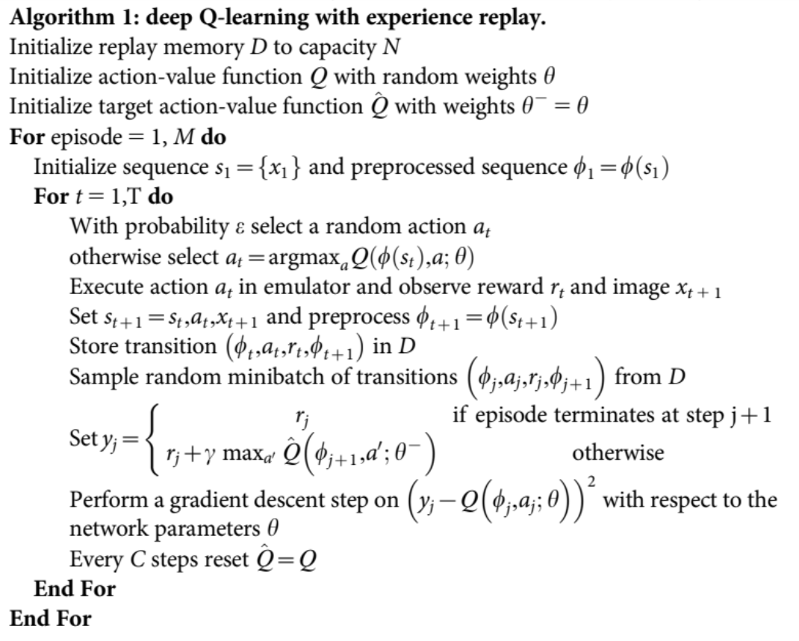

# Playing-Attari-Breakout-using-DeepQNetworks-
Pytorch Implementation Of DeepQ Reinforcement Learning Algorithm to play Attari Breakout game. 

## To know the basics of Deep Q-Reinforcement Learning
[Demistifying Deep Reinforcement Learning](https://www.intel.com/content/www/us/en/artificial-intelligence/posts/demystifying-deep-reinforcement-learning.html)

## Requirements
- OpenAI Gym with attari environment.[[Installation for Linux]](https://github.com/openai/gym#installation)  [[For windows]](https://towardsdatascience.com/how-to-install-openai-gym-in-a-windows-environment-338969e24d30)
- OpenCV
- Pytorch
- TensorboardX

## How to run :
- To train DQN: python main.py --train_dqn
- To test DQN : python main.py --test_dqn --resume (Path to model weights)

## Algorithm :

Reference Paper: Human Level Control Through Deep Reinforcement Learning.[Link](https://web.stanford.edu/class/psych209/Readings/MnihEtAlHassibis15NatureControlDeepRL.pdf)

## Implementation Details:

## Model:

### Experience Replay Buffer
We store states, action, reward in memory to be used for experience replay. We sample random minibatches from this buffer to train our model. It helps in decorrelating the input. The number of frames that can be stored in this buffer depends on the size of your RAM / GPU Memory. In my implementation, I used a cyclic replay buffer of size 0.4M frames. [[1]](https://pytorch.org/tutorials/intermediate/reinforcement_q_learning.html) For the first 50000 steps of training, we do not train our model, we only use this to fill our replay buffer to a initial capacity.

**An important thing to take into consideration is the amount of memory 1M(used by Deepmind) frames will consume in your RAM. If we store scaled versions(dtype: np.float32) of frames in buffer, each frame costs us 0.12Mb. If you use 1M frames, the total memory you require would be around 100Gb which we obviously dont want. To make efficient use of memory, do not scale the frames, simply store each frame in np.uint8 format in buffer and whenever required just convert to float32. In np.uint8 format, the total memory required would be around 25Gb for 1M frames.  For 0.4M frames the total memory overhead is around 10~11Gb.**

### PreProcessing:
attari_wrapper_openai.py modifies the original attari environment to add functionalities which was implemented in DeepMind's Paper.
It also applies a pre-processing function to convert the original 210x160x3 frame to 84x84 grayscale frame and stacks up 4 recent frames to get the input of shape 4x84x84 to be forwared to the CNN model. Make sure you do not set the Scale parameter as True to avoid memory issues. 

### Training:

#### Using a linearly decaying epsilon greedy policy to take actions:
We start with an initial epsilon value of 1.0 for 50000 steps, for the next 1M steps, the value of epsilon is linearly decreased to a constant final value of 0.01 untill termination of training. 

#### Optimizing :
From 50000 step onwards, we start to optimize our model, For every 4 steps into the epsiode, we sample a random batch of frames, compute losses using the policy network and target network and update. The code is implemented in optimize_model() method. I run the training for a total of around 4M steps with 45k episodes.

## Results:

## Additional Tips

## References

